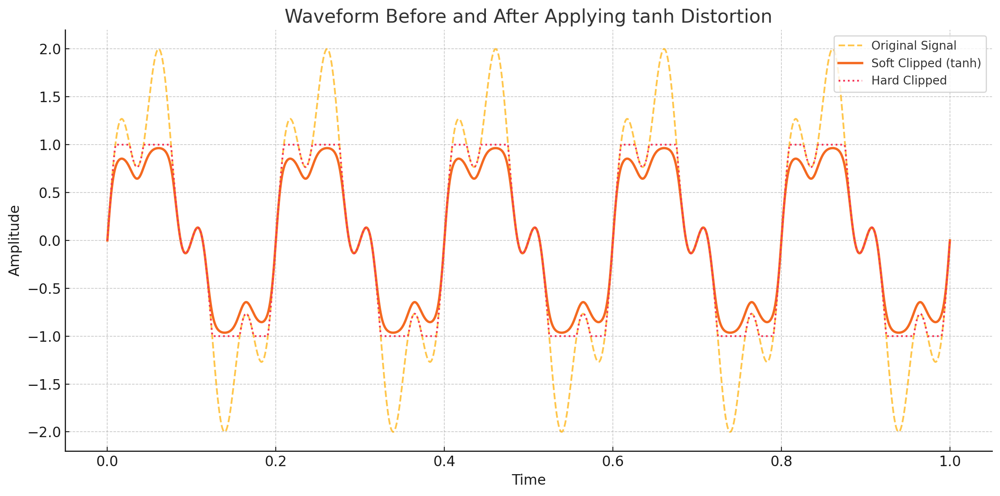

# Tanh Distortion

이 코드는 **AudioKit**의 `TanhDistortion`을 이용한 오디오 왜곡 효과를 적용하는 Swift 클래스입니다. 이름 그대로 `tanh()` (쌍곡 탄젠트) 함수를 활용한 디스토션 알고리즘으로, **부드럽지만 강한** 왜곡을 줄 수 있습니다.

---

## 🔧 클래스 설명: `TanhDistortionConductor`

### ✅ 상속

* `BasicEffectConductor<TanhDistortion>`: 커스텀 효과를 공통적으로 다루는 기본 클래스에서 상속.
* `<TanhDistortion>` 제네릭을 통해 AudioKit의 디스토션 노드를 지정.

---

## 🎛 파라미터 설명

| 파라미터 명칭                      | 기본값   | 범위             | 설명                            |
| ---------------------------- | ----- | -------------- | ----------------------------- |
| **Pregain**                  | `2.0` | `0.0...10.0`   | 입력 신호에 곱해지는 값. 클수록 강한 디스토션 발생 |
| **Postgain**                 | `0.5` | `0.0...10.0`   | 디스토션 후의 볼륨 조절. 출력 크기를 조정      |
| **Positive Shape Parameter** | `0.0` | `-10.0...10.0` | 양수 영역의 왜곡 곡률 조정               |
| **Negative Shape Parameter** | `0.0` | `-10.0...10.0` | 음수 영역의 왜곡 곡률 조정               |

---

## 🎧 TanhDistortion이란?

* 수학 함수 `tanh(x)`를 통해 입력을 부드럽게 압축 → **클리핑 없이 부드러운 디스토션** 제공
* 사인파처럼 완만하게 왜곡되어 하드 클리핑보다 **더 음악적인 결과**를 냄
* 양/음수 각각의 비선형성 조절 가능 → 다양한 톤 설계 가능

---

`tanh(x)`는 **쌍곡 탄젠트 함수(hyperbolic tangent function)** 로, 수학적 정의는 다음과 같습니다:

---

## 📐 정의

$$
\tanh(x) = \frac{\sinh(x)}{\cosh(x)} = \frac{e^x - e^{-x}}{e^x + e^{-x}}
$$

여기서

* $\sinh(x) = \frac{e^x - e^{-x}}{2}$: 쌍곡 사인
* $\cosh(x) = \frac{e^x + e^{-x}}{2}$: 쌍곡 코사인

---

## 📉 그래프적 특징

* **입력 범위**: $x \in (-\infty, \infty)$
* **출력 범위**: $(-1, 1)$
* **중앙 대칭**: $\tanh(-x) = -\tanh(x)$ → **기울기 0을 중심으로 대칭적**
* $x = 0$일 때 $\tanh(0) = 0$
* $x \to \infty$일 때 $\tanh(x) \to 1$
* $x \to -\infty$일 때 $\tanh(x) \to -1$

그래프는 다음과 같은 S자형 곡선:

```
1 ────────┐         ┐
          │         │
          │        /
          │       /
0 ────────●──────●──────── x
          │     /
          │    /
          │   /
-1 ───────┘  └────────────
```

---

## 🔊 오디오 처리에서의 의미

`tanh(x)`는 오디오에서 **소프트 클리핑(soft clipping)** 으로 자주 사용됩니다.

| 비교 항목 | Hard Clipping | Soft Clipping (`tanh(x)`) |
| ----- | ------------- | ------------------------- |
| 파형    | 잘려 나감         | 부드럽게 꺾임                   |
| 사운드   | 거칠고 왜곡 심함     | 따뜻하고 자연스러움                |
| 비선형성  | 없음            | 있음 (곡선 형태)                |

예:
입력값이 커질수록 출력은 서서히 1 또는 -1에 수렴하게 되므로 **너무 큰 신호를 자연스럽게 제한하는 효과**를 냅니다.
즉, 진폭이 일정 이상 커져도 **왜곡이 심하지 않고 부드럽게 들리는 디스토션**이 됩니다.

---

## 💡 용도 요약

* **디스토션 효과**: 부드러운 왜곡, 따뜻한 톤 제공
* **신호 제한**: 출력 신호의 크기를 일정 범위(−1\~1)로 압축
* **비선형 처리**: 악기나 보컬 등의 신호를 더 “음악적으로” 가공

---



위 그래프는 `tanh(x)` 디스토션 적용 전후의 파형을 시각화한 것입니다:

* **Original Signal (회색 점선)**: 원래의 오디오 신호로, 사인파 기반이며 진폭이 ±2 이상까지 도달합니다.
* **Soft Clipped (tanh, 파란 선)**: `tanh(x)` 함수 적용 결과입니다. 진폭이 ±1 근처에서 점점 완만하게 눌리며, 자연스럽게 왜곡되어 **부드러운 디스토션** 효과를 냅니다.
* **Hard Clipped (노란 점선)**: 강제로 ±1에서 잘라낸 결과로, 디스토션은 강하지만 파형이 갑자기 꺾여 **거친 왜곡**을 유발합니다.

이러한 `tanh` 적용은 음악 신호에서 **부드러운 사운드 왜곡**을 줄 때 매우 효과적입니다.


